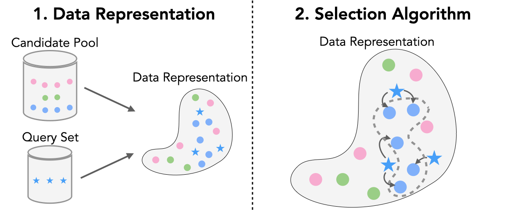

# A Critical Look at Targeted Instruction Selection

Code for A Critical Look at Targeted Instruction Selection: Disentangling What Matters (and What Doesn’t).

In this work, we aim to bring clarity to the landscape of targeted instruction selection by disentangling and systematically analyzing the two core ingredients: (i) data representation, and (ii) the selection algorithm (see Figure).



Paper: **TODO**

Datasets: [Harvard-DCML/targeted-instruction-selection](https://huggingface.co/datasets/Harvard-DCML/targeted-instruction-selection)

## Table of Contents

- [A Critical Look at Targeted Instruction Selection](#a-critical-look-at-targeted-instruction-selection)
  - [Setup](#setup)
  - [Data Representation](#data-representation)
    - [RDS+](#rds)
    - [EMBED](#embed)
    - [LESS](#less)
  - [Quantile Experiment](#quantile-experiment)
    - [Create Distance Quantiles](#create-distance-quantiles)
    - [Training](#training)
    - [Evaluation](#evaluation)
  - [Budget Experiment with Different Data Representations and Selection Algorithms](#budget-experiment-with-different-data-representations-and-selection-algorithms)
    - [RDS+, EMBED, and LESS with Round Robin](#rds-embed-and-less-with-round-robin)
    - [LESS with Doubly Greedy, UOT, KNN-Unif., KNN-KDE](#less-with-doubly-greedy-uot-knn-unif-knn-kde)
    - [Training](#training-1)
    - [Evaluation](#evaluation-1)
  - [Miscellaneous](#miscellaneous)
    - [Random Sampling](#random-sampling)
    - [Zero-Shot Evaluation](#zero-shot-evaluation)
  - [Plotting](#plotting)
  - [Credits](#credits)
  - [Citation](#citation)


## Setup

Download the code and set up the environment:
```bash
git clone https://github.com/Harvard-DCML/targeted-instruction-selection.git
cd targeted-instruction-selection
mamba create --yes -n tis python=3.12 -c conda-forge
mamba activate tis
pip install -r requirements.txt
```

Download the datasets from Huggingface and place them in `data/eval`:
```bash
sh download_eval.sh
```

## Data Representation
Here we describe how to compute the data representations for RDS+, EMBED, and LESS. The computed representations are saved in `files/index` and are used for both the quantile and budget experiments.

Skip this step, if you prefer to use pre-computed datasets from [Huggingface](https://huggingface.co/datasets/Harvard-DCML/targeted-instruction-selection).

### RDS+
Run the following command to compute RDS+ representations with `meta-llama/Llama-2-7b-hf` and compute the cosine similarity between the train and dev representations:
```bash
ds="bbh"
python3 -m representation.rds.compute_rds_embeds \
    --model_name meta-llama/Llama-2-7b-hf \
    --train_dataset_name "Harvard-DCML/tulu-v2-197K-processed" \
    --train_index_path "files/index/rds_llama-2-7b-hf/train_embeds.pt" \
    --dev_dataset_name ${ds} \
    --dev_index_path "files/index/rds_llama-2-7b-hf/${ds}_dev_embeds.pt" \
    --save_dir "files/index/rds_llama-2-7b-hf" \
    --batch_size 1 \
    --pooling weighted_mean
```

### EMBED

Run the following command to compute EMBED representations with `sentence-transformers/gtr-t5-base` and compute the cosine similarity between the train and dev representations:
```bash
ds="bbh"  # options: bbh, codex, gsm8k, tydiqa, mmlu_pro
SAVE_DIR="files/index/embed_gtr-t5-base"
python3 -m representation.embed.compute_sentence_embeds.py \
    --model_name "sentence-transformers/gtr-t5-base" \
    --train_dataset_name "Harvard-DCML/tulu-v2-197K-processed" \
    --train_index_path ${SAVE_DIR}/train_embeds.pt \
    --dev_dataset_name ${ds} \
    --dev_index_path ${SAVE_DIR}/${ds}_dev_embeds.pt \
    --save_dir ${SAVE_DIR} \
    --batch_size 16
```

### LESS

Below we describe three steps to compute LESS representations: (i) train a model on the warmup dataset, (ii) compute the train and dev gradients, and (iii) compute the similarity matrix.

**1.** Run the following command to train a model on the warmup dataset with `meta-llama/Llama-2-7b-hf`:
```bash
python3 -m training.train_sft \
    --model_name "meta-llama/Llama-2-7b-hf" \
    --output_dir "files/models/less_llama-2-7b-hf-warmup" \
    --per_device_train_batch_size 1 \
    --gradient_accumulation_steps 128 \
    --num_train_epochs 4 \
    --optim adamw_torch \
    --learning_rate 2e-5 \
    --seed 0 \
    --warmup_ratio 0.03 \
    --lr_scheduler_type linear \
    --weight_decay 0. \
    --logging_steps 1 \
    --train_dataset_name "Harvard-DCML/tulu-v2-10K-warmup-processed" \
    --run_name "less-wamrup" \
    --report_to "wandb" \
    --overwrite_output_dir True \
    --save_strategy epoch \
    --use_lora True \
    --lora_r 128 \
    --lora_alpha 512 \
    --lora_dropout 0.1 \
```


**2.1** Run the following command to compute the train gradients for the train set in chunks (due to the large size of the train set) with `meta-llama/Llama-2-7b-hf`:
```bash
TOTAL=197000
STEP_SIZE=10000
ckpts=(79 158 237 316)
for ckpt in ${ckpts[@]}; do
    for ((start_index=0; start_index<TOTAL; start_index+=STEP_SIZE)); do
        export start_index
        export end_index=$((start_index + STEP_SIZE))
        python3 -m representation.less.compute_less_embeds \
            --ckpt_path "files/models/less_llama-2-7b-hf-warmup/checkpoint-${ckpt}" \
            --ckpt_step ${ckpt} \
            --train_dataset_name "Harvard-DCML/tulu-v2-197K-processed" \
            --compute_train_grads \
            --gradient_type "adam" \
            --save_dir "files/index/less_llama-2-7b-hf" \
            --start_index ${start_index} \
            --end_index ${end_index}
    done
done
```

**2.2** Run the following command to compute the dev gradients for the dev set with `meta-llama/Llama-2-7b-hf`:
```bash
ckpts=(79 158 237 316)
ds="bbh"  # options: bbh, codex, gsm8k, tydiqa, mmlu_pro
for ckpt in ${ckpts[@]}; do
    python3 -m representation.less.compute_less_embeds \
        --ckpt_path "files/models/less_llama-2-7b-hf-warmup/checkpoint-${ckpt}" \
        --ckpt_step ${ckpt} \
        --dev_dataset_name ${ds} \
        --compute_dev_grads \
        --gradient_type sgd \
        --save_dir "files/index/less_llama-2-7b-hf"
done
```

**3.** Run the following command to compute the similarity matrix with `meta-llama/Llama-2-7b-hf`:
```bash
ckpts=(79 158 237 316)
ds="bbh"  # options: bbh, codex, gsm8k, tydiqa, mmlu_pro
python3 -m embed.less.compute_less_similarity \
    --train_dataset_name "Harvard-DCML/tulu-v2-197K-processed" \
    --dev_dataset_name "${ds}" \
    --output_dir "files/index/less_llama-2-7b-hf" \
    --ckpt_dir "files/models/less_llama-2-7b-hf-warmup/" \
    --checkpoint_steps "${CHECKPOINT_STEPS[@]}"
```

## Quantile Experiment
In this section, we describe how to run the quantile experiment for the distance-based selection method. We create 10 distance quantiles based on the similarity matrix computed using different representations (RDS+, EMBED, LESS).


We provide several pre-computed subsets on Hugging Face to make it easy to reproduce the distance quantile experiments:
- We include the pre-computed quantile subsets for **RDS+** and **LESS** selection on Hugging Face under [Harvard-DCML/tis-quantile-datasets-Llama-2-7b-hf](https://huggingface.co/datasets/Harvard-DCML/tis-quantile-datasets-Llama-2-7b-hf), and for **EMBED** under [Harvard-DCML/tis-quantile-datasets-gtr-t5-base](https://huggingface.co/datasets/Harvard-DCML/tis-quantile-datasets-gtr-t5-base).

- We also include additional distance quantiles for **RDS+** and **LESS** for `meta-llama/Llama-3.2-3B`, `Qwen/Qwen3-4B-Base`, `HuggingFaceTB/SmolLM3-3B-Base`, and `allenai/Olmo-3-1025-7B` on Hugging Face under [Harvard-DCML/tis-quantile-datasets-Llama-3.2-3B](https://huggingface.co/datasets/Harvard-DCML/tis-quantile-datasets-Llama-3.2-3B), [Harvard-DCML/tis-quantile-datasets-Qwen3-4B-Base](https://huggingface.co/datasets/Harvard-DCML/tis-quantile-datasets-Qwen3-4B-Base), [Harvard-DCML/tis-quantile-datasets-SmolLM3-3B-Base](https://huggingface.co/datasets/Harvard-DCML/tis-quantile-datasets-SmolLM3-3B-Base), and [Harvard-DCML/tis-quantile-datasets-Olmo-3-1025-7B](https://huggingface.co/datasets/Harvard-DCML/tis-quantile-datasets-Olmo-3-1025-7B), respectively.


### Create Distance Quantiles
You can skip this step if you prefer to use the pre-computed quantile subsets in Huggingface.

To create the distance quantiles for the quantile experiment, run the following command:
```bash
ds="bbh"  # options: bbh, codex, gsm8k, tydiqa, mmlu_pro
python3 -m quantile.convert_to_dist_quant \
    --selection_method "round_robin" \
    --subset_dataset_dir "files/datasets/less_distance_quantiles_llama-2-7b-hf" \
    --similarity_matrix_path "files/index/less_llama-2-7b-hf/${ds}_cossim.npy" \
    --train_dataset "Harvard-DCML/tulu-v2-197K-processed" \
    --dev_dataset_name "${ds}"
```

### Training
To train the models on the quantile subsets, run the following command:
```bash
ds="bbh"  # options: bbh, codex, gsm8k, tydiqa, mmlu_pro
for distance_quantile in {0..9};
do
    python3 -m training.train_sft \
        --model_name "meta-llama/Llama-2-7b-hf" \
        --output_dir "files/models/less_llama-2-7b-hf_${ds}_dist_quantile_${distance_quantile}" \
        --per_device_train_batch_size 1 \
        --gradient_accumulation_steps 128 \
        --num_train_epochs 2 \
        --learning_rate 2e-5 \
        --seed 0 \
        --warmup_ratio 0.03 \
        --lr_scheduler_type linear \
        --weight_decay 0.0 \
        --save_strategy no \
        --logging_steps 1 \
        --train_dataset_name "Harvard-DCML/tis-quantile-datasets-Llama-2-7b-hf" \
        --train_dataset_config_name "less_rr_${ds}_quantile${distance_quantile}_top500" \
        --run_name "less_llama-2-7b-hf_${ds}_dist_quantile_${distance_quantile}" \
        --report_to "wandb"
done
```
This command trains 10 models on the distance quantiles created using different representations with a fixed selection method (round robin in this case).

Options:
- `--train_dataset_name`: The name of the training dataset. For the quantile experiment, this should be the name of the quantile dataset in Huggingface (e.g., `Harvard-DCML/tis-quantile-datasets-Llama-2-7b-hf`). If you are using embed, the dataset name should be `Harvard-DCML/tis-quantile-datasets-gtr-t5-base`.
- `--train_dataset_config_name`: The name of the quantile subset (e.g., `less_rr_${ds}_quantile${distance_quantile}_top500` for the round robin selection method). The config_names have the following format: `<representation_name>_rr_${ds}_quantile${distance_quantile}_top500`.
- `--train_dataset_path`: The path to the local training dataset. This should be used if you are using a local jsonl dataset. This overrides the `--train_dataset_name` and `--train_dataset_config_name` arguments. The local dataset should be in jsonl format with the same format as the Huggingface datasets.

### Evaluation


To evaluate the models trained on the quantile subsets, run the following command:
```bash
ds="bbh"  # options: bbh, codex, gsm8k, tydiqa, mmlu_pro
for distance_quantile in {0..9};
do
    python3 -m evaluation.run_eval \
        --model_name_or_path "files/models/less_llama-2-7b-hf_${ds}_dist_quantile_${distance_quantile}" \
        --eval_dataset ${ds} \
        --save_dir "files/results/distance_quantiles/llama-2-7b-hf/true_metric/less_${ds}_dist_quantile_${distance_quantile}" \
        --apply_chat_template
done
```
Options:
- `--model_name_or_path`: The path to the trained model.
- `--eval_dataset`: The name of the evaluation dataset (e.g., `bbh`, `codex`, `gsm8k`, `tydiqa`, `mmlu_pro`).
- `--save_dir`: The directory to save the evaluation results. For the quantile experiment, this should be `files/results/distance_quantiles/llama-2-7b-hf/true_metric/less_${ds}_dist_quantile_${distance_quantile}`.


This command evaluates models trained on the 10 distance quantiles and reports the loss on the query set:
```bash
ds="bbh"  # options: bbh, codex, gsm8k, tydiqa, mmlu_pro
for distance_quantile in {0..9};
do
    python3 -m evaluation.ce_loss \
        --model_name_or_path "files/models/less_llama-2-7b-hf_${ds}_dist_quantile_${distance_quantile}" \
        --eval_dataset ${ds} \
        --save_dir "files/results/llama-2-7b-hf/ce_loss/less_${ds}_dist_quantile_${distance_quantile}" \
done
```


## Budget Experiment with Different Data Representations and Selection Algorithms
In this section, we describe how to run instruction selection across different budgets using different data representations and selection algorithms.

We provide several pre-computed subsets on Hugging Face to make it easy to reproduce the budget experiments:

- We release pre-computed subsets for **RDS++** and **LESS** with **round-robin** selection under [Harvard-DCML/tis-subset-datasets-Llama-2-7b-hf](https://huggingface.co/datasets/Harvard-DCML/tis-subset-datasets-Llama-2-7b-hf), and for **EMBED** under [Harvard-DCML/tis-subset-datasets-gtr-t5-base](https://huggingface.co/datasets/Harvard-DCML/tis-subset-datasets-gtr-t5-base). In addition, we release **LESS** subsets selected with **doubly greedy**, **UOT**, **KNN-Uniform**, and **KNN-KDE** under [Harvard-DCML/tis-subset-datasets-Llama-2-7b-hf](https://huggingface.co/datasets/Harvard-DCML/tis-subset-datasets-Llama-2-7b-hf), using different dataset config names (e.g., `less_dg_${ds}_num_samples_${num_samples}` for LESS with doubly greedy selection).

- We also release additional **RDS+** and **LESS** subsets for other base models under [Harvard-DCML/tis-subset-datasets-Llama-3.2-3B](https://huggingface.co/datasets/Harvard-DCML/tis-subset-datasets-Llama-3.2-3B), [Harvard-DCML/tis-subset-datasets-Qwen3-4B-Base](https://huggingface.co/datasets/Harvard-DCML/tis-subset-datasets-Qwen3-4B-Base), [Harvard-DCML/tis-subset-datasets-SmolLM3-3B-Base](https://huggingface.co/datasets/Harvard-DCML/tis-subset-datasets-SmolLM3-3B-Base), and [Harvard-DCML/tis-subset-datasets-Olmo-3-1025-7B](https://huggingface.co/datasets/Harvard-DCML/tis-subset-datasets-Olmo-3-1025-7B), respectively.


### RDS+, EMBED, and LESS with Round Robin

Run the following command to create the subsets with round robin selection method:
```bash
ds="bbh"  # options: bbh, codex, gsm8k, tydiqa, mmlu_pro
python3 -m selection.sim_subset \
    --selection_method "round_robin" \
    --subset_dataset_dir "files/datasets/rds_rr_llama-2-7b-hf" \
    --similarity_matrix_path "files/index/rds_llama-2-7b-hf/${ds}_cossim.npy" \
    --train_dataset_name "Harvard-DCML/tulu-v2-197K-processed" \
    --dev_dataset_name "${ds}"
```
Options:
- `--selection_method`: The selection method to use. For this command, this should be `round_robin`. You can change this to `doubly_greedy` and  `uot`.
- `--subset_dataset_dir`: The directory to save the created subsets. For this command, this should be `files/datasets/rds_rr_llama-2-7b-hf`.
- `--similarity_matrix_path`: The path to the similarity matrix computed using the corresponding representation. For this command, this should be `files/index/rds_llama-2-7b-hf/${ds}_cossim.npy`. You need to change this path depending on the representation you are using (e.g., `files/index/embed_gtr-t5-base/${ds}_cossim.npy` for EMBED and `files/index/less_llama-2-7b-hf/${ds}_cossim.npy` for LESS).

### LESS with Doubly Greedy, UOT, KNN-Unif., KNN-KDE

Run the following command to create the subsets with doubly greedy and UOT methods with :
```bash
ds="bbh"  # options: bbh, codex, gsm8k, tydiqa, mmlu_pro
selection=("doubly_greedy" "uot")
for method in ${selection[@]}; do
    python3 -m selection.sim_subset \
        --selection_method "${method}" \
        --subset_dataset_dir "files/datasets/less_${method}_llama-2-7b-hf" \
        --similarity_matrix_path "files/index/less_llama-2-7b-hf/${ds}_cossim.npy" \
        --train_dataset_name "Harvard-DCML/tulu-v2-197K-processed" \
        --dev_dataset_name "${ds}"
done
```

Run the following command to create the subsets with KNN-Uniform and KNN-KDE methods:
```bash
ds="bbh"  # options: bbh, codex, gsm8k, tydiqa, mmlu_pro
ckpts=(79 158 237 316)
tsds_method="knn_kde"  # options: knn_kde, knn_uniform
python3 -m selection.tsds_subset \
  --train_dataset_name "Harvard-DCML/tulu-v2-197K-processed" \
  --dev_dataset_name "${ds}" \
  --embed_dir "files/index/less_llama-2-7b-hf" \
  --ckpt_dir "files/models/less_llama-2-7b-hf-warmup" \
  --checkpoint_steps "${ckpts[@]}" \
  --subset_dataset_dir "files/datasets/less_${tsds_method}_llama-2-7b-hf" \
  --selection_method "${tsds_method}"
```

Note this command requires the LESS representations and the model checkpoints trained on the warmup dataset. You can change the `--embed_dir` and `--ckpt_dir` arguments depending on where you have saved the LESS representations and the model checkpoints.

### Training

To train the models on the created subsets, run the following command:
```bash
ds="bbh"  # options: bbh, codex, gsm8k, tydiqa, mmlu_pro
for num_samples in {500 1000 2500 5000 10000};
do
    python3 -m training.train_sft \
        --model_name "meta-llama/Llama-2-7b-hf" \
        --output_dir "files/models/less_rr_llama-2-7b-hf_${ds}_num_samples_${num_samples}_seed_0" \
        --per_device_train_batch_size 1 \
        --gradient_accumulation_steps 128 \
        --num_train_epochs 2 \
        --learning_rate 2e-5 \
        --seed 0 \
        --warmup_ratio 0.03 \
        --lr_scheduler_type linear \
        --weight_decay 0.0 \
        --save_strategy no \
        --logging_steps 1 \
        --train_dataset_name "Harvard-DCML/tis-subset-datasets-Llama-2-7b-hf" \
        --train_dataset_config_name "less_rr_${ds}_10000" \
        --num_samples ${NUM_SAMPLES} \
        --run_name "less_rr_llama-2-7b-hf_${ds}_num_samples_${num_samples}_seed_0" \
        --report_to "wandb"
done
```
Options:
- `--train_dataset_name`: The name of the training dataset. For the quantile experiment, this should be the name of the quantile dataset on Hugging Face (e.g., `Harvard-DCML/tis-subset-datasets-Llama-2-7b-hf`). If you are using EMBED, the dataset name should be `Harvard-DCML/tis-subset-datasets-gtr-t5-base`.
- `--train_dataset_config_name`: The name of the quantile subset (e.g., `less_{selection_method}_${ds}_quantile${distance_quantile}_top500` for the round-robin selection method). The `config_name`s follow these formats: `rds_rr_${ds}_10000` for RDS+ with round-robin selection; `less_{selection_method}_${ds}_10000` for LESS with `selection_method = {rr, dg, uot, knn_uniform, knn_kde}`; and `embed_rr_${ds}_10000` for EMBED with round-robin selection.
- `--train_dataset_path`: The path to the local training dataset. Use this if you are training from a local JSONL dataset. This overrides `--train_dataset_name` and `--train_dataset_config_name`. The local dataset should be in JSONL format and match the Hugging Face dataset schema.
- `--num_samples`: The number of samples to select for training. Set this to the corresponding budget (e.g., 500, 1000, 2500, 5000, 10000).


### Evaluation


To evaluate the models trained on the subsets created with different data representations and selection algorithms on the test set, run the following command:
```bash
export ds="bbh"
for num_samples in {500 1000 2500 5000 10000};
do
    python3 -m evaluation.run_eval \
        --model_name_or_path "files/models/less_rr_llama-2-7b-hf_${ds}_num_samples_${num_samples}_seed_0" \
        --eval_dataset ${ds} \
        --save_dir "files/results/distance_quantiles/llama-2-7b-hf/true_metric/less_rr_${ds}_num_samples_${num_samples}_seed_0" \
        --apply_chat_template
done
```
Make sure to pass the appropriate `--model_name_or_path`, `--eval_dataset`, and `--save_dir` arguments depending on the data representation, selection method, and budget you are evaluating.

This command evaluates models trained on the subsets and reports the loss on the query set:
```bash
ds="bbh"  # options: bbh, codex, gsm8k, tydiqa, mmlu_pro
for num_samples in {500 1000 2500 5000 10000};
do
    python3 -m evaluation.ce_loss \
        --model_name_or_path "files/models/less_llama-2-7b-hf_${ds}_num_samples_${num_samples}_seed_0" \
        --eval_dataset ${ds} \
        --save_dir "files/results/llama-2-7b-hf/ce_loss/less_${ds}_num_samples_${num_samples}_seed_0" \
done
```

## Miscellaneous

### Random Sampling

To create random subsets, run the following command:
```bash
python3 -m selection.random --subset_dataset_dir "files/data/random_unbalanced" --seed 0
```

### Zero-Shot Evaluation

To evaluate base models in a zero-shot setting, run the following command:
```bash
python3 -m evaluation.run_eval \
    --model_name_or_path "meta-llama/Llama-2-7b-hf" \
    --eval_dataset ${EVAL_DATASET}
    --save_dir "files/results/zero_shot/llama-2-7b-hf/true_metric/"
```

## Plotting
If you want to reproduce the plots for the quantile and budget experiments in the paper without running any experiments, you can use the pre-computed `.csv` files in `assets/plot_data` to generate the plots.
```bash
python3 plotting/plot_quantile_budget.py --model_name meta-llama/Llama-2-7b-hf
```
This code reads the `.csv` files in `assets/plot_data` to produce the plots.
- `--model_name`: We include plotting data for five models (`meta-llama/Llama-2-7b-hf`, `meta-llama/Llama-3.2-3B`, `HuggingFaceTB/SmolLM3-3B-Base`, `Qwen/Qwen3-4B-Base`, `allenai/Olmo-3-1025-7B`). You can specify which model to plot by providing the corresponding `model_name` (e.g., `meta-llama/Llama-2-7b-hf` for Llama 2 7B).
- `--focus_bin0`: Whether to focus on the first distance quantile (only available for Llama 2 7B).

## Credits

Our code is built on [princeton-nlp/LESS](https://github.com/princeton-nlp/LESS) and [hamishivi/automated-instruction-selection](https://github.com/hamishivi/automated-instruction-selection).

## Citation
If you find this work useful, please consider citing our paper:

```
@article{nayak2026critical,
  title={A Critical Look at Targeted Instruction Selection: Disentangling What Matters (and What Doesn’t)},
  author={Nayak, Nihal V. and Rodriguez-Diaz, Paula and Hulkund, Neha and Beery, Sara and Alvarez-Melis, David},
  journal={arXiv},
  year={2026},
}
```

